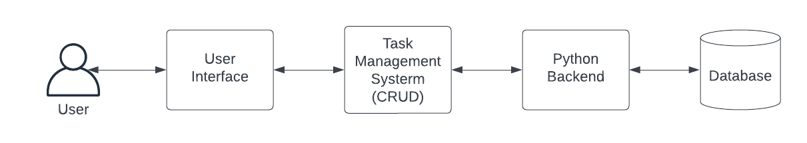
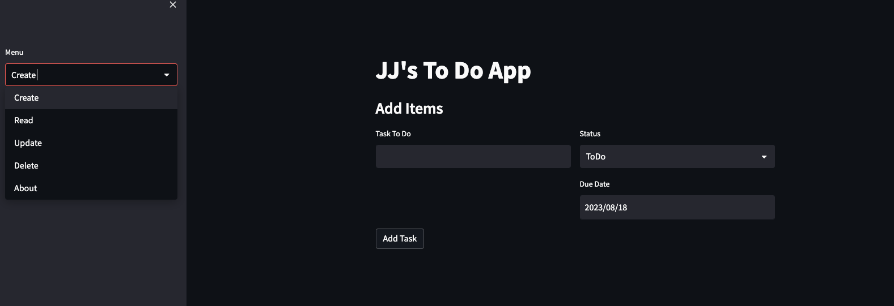
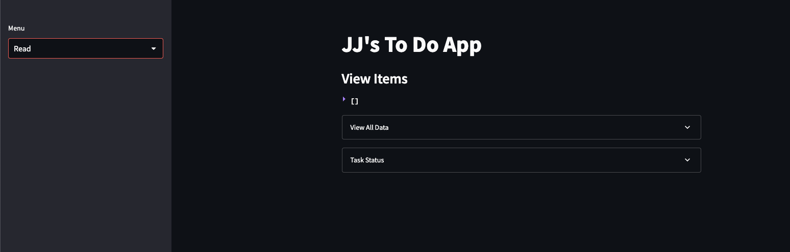
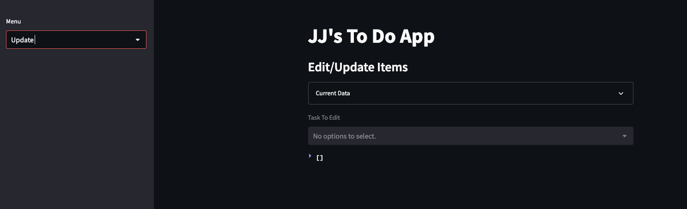
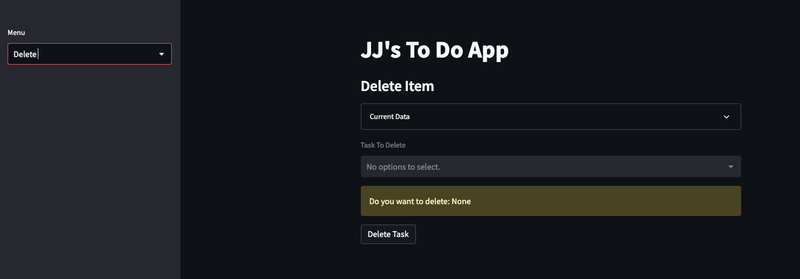
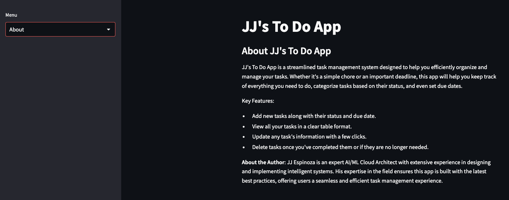

# JJ's To Do App

JJ's To Do App is a streamlined task management system designed to help users efficiently organize and manage their tasks. Using the Streamlit framework, this app allows you to keep track of everything you need to do, categorize tasks based on their status, and set due dates. 

The app is crafted by JJ Espinoza, an expert AI/ML Cloud Architect, ensuring its build with the latest best practices, offering users a seamless and efficient task management experience.

## Architecture




## Features

- **Add Tasks**: Quickly add new tasks along with their status and due date.

- **View Tasks**: View all your tasks in a well-organized table format.

- **Update Tasks**: Edit any task's information with just a few clicks.

- **Delete Tasks**: Remove tasks once you've completed them or if they are no longer required.

- **About Page**: Background on the application.


## Setup & Installation

1. **Clone the Repository**
   ```bash
   git clone https://github.com/<your-github-username>/streamlit-crud-app.git
   cd streamlit-crud-app`

2. **Install Dependencies**
   ```bash
   pip install -r requirements.txt

3. **Run the App**
    ```bash
   streamlit run app.py


The app will be live at http://localhost:8501 by default.

## Contributing

Pull requests are welcome. For major changes, please open an issue first to discuss what you would like to change.